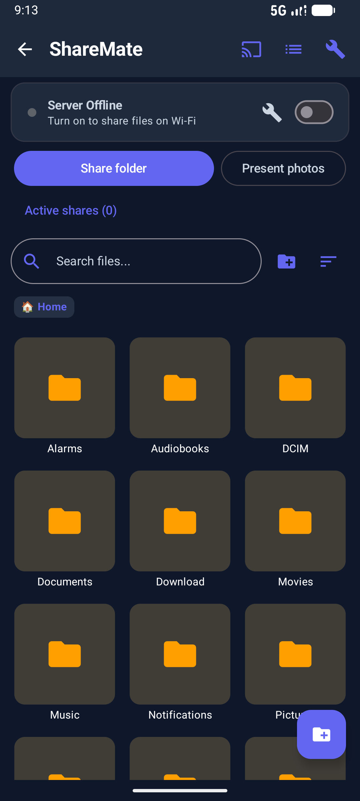
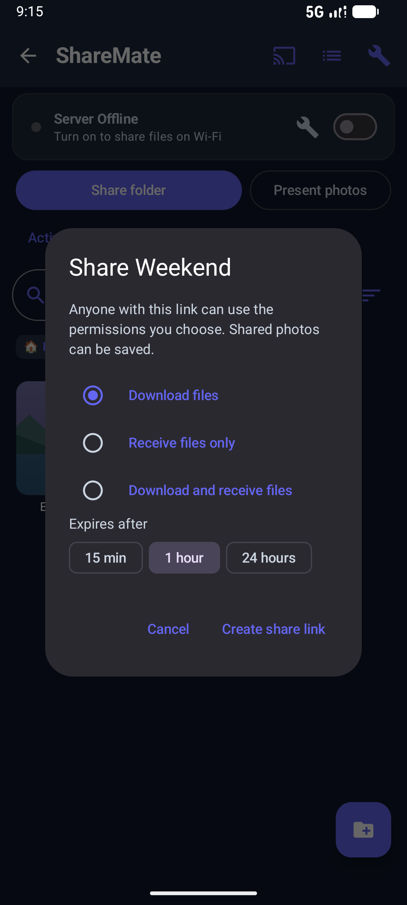
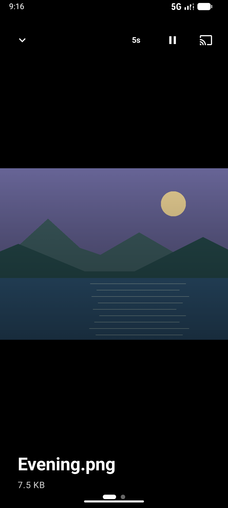

# ShareMate

Share files and photos from your Android phone with nearby devices. Recipients open a link in their browser, with no companion app required.

ShareMate is the local sharing app in the Mate series, alongside MusicMate, TradingMate, FarmMate, and BillMate. It runs on Android 8.0 and newer.

## Install the preview

Download the APK from the [ShareMate releases](https://github.com/thawee/FileMate/releases) page. Allow installation from your browser or file manager when Android prompts you.

Version 2.3.1 is a debug-signed preview for testing. It can update an existing installation only if that installation uses the same signing key.

## What you can do

- Send selected files or a whole folder through a link or QR code.
- Collect files in a folder with a receive-only link.
- Choose when a link expires and revoke it when you finish.
- Receive files from other Android apps through the Share menu.
- View photos and play a slideshow on your phone or in a guest browser.
- Manage your phone's files from your computer's browser, including uploads, downloads, search, and ZIP archives.

## See the app

These screenshots come from the Android emulator. The photo folder contains demo illustrations.

| Browse your phone | Choose sharing permissions | Present photos |
| --- | --- | --- |
|  |  |  |

## Share files with someone nearby

1. Connect your phone and the recipient's device to the same Wi-Fi network or phone hotspot.
2. Open ShareMate and grant storage access when prompted.
3. Open a folder and tap **Share folder**. To share particular files, select them and tap **Share selected**.
4. Choose **Download files**, **Receive files only**, or **Download and receive files**. Selected files support downloads only.
5. Choose an expiry of **15 min**, **1 hour**, or **24 hours**.
6. Tap **Create share link**. Show the guest QR code or copy the link to the recipient.

The recipient opens the link in a browser while your phone's server is running. A receive-only link lets the recipient upload without seeing the folder's existing files.

Keep guest links private. Anyone with a link can use its permissions, and recipients can save shared photos. Guest uploads accept files up to 20 MiB each and do not replace existing filenames.

To end access early, open **Active shares** and revoke the link. Turning off the server ends every active share.

## Receive files from another Android app

1. Select files in Gallery or another app and open its Share menu.
2. Choose **ShareMate**.
3. Browse to the destination folder and tap **Save here**.
4. Confirm with **Save files** and review the results.

ShareMate copies the files into your chosen folder without replacing existing files.

## Manage files from your computer

1. Connect your computer and phone to the same local network.
2. Turn on the server switch in ShareMate.
3. Enter the address shown in the app into your computer's browser.
4. Sign in with the current owner PIN shown in ShareMate.

The owner dashboard lets you upload, download, move, delete, and preview files. You can cancel or retry uploads in its transfer queue. Cancelling an upload does not remove a file that the phone has already received.

The owner connection QR code grants file-management access. Use a guest share QR code when sending content to someone else.

## Show photos on a larger screen

Open a photo folder and tap **Present photos** to start a slideshow on your phone. For another device, share the folder with download permission and open its guest link in a browser.

For a TV with a browser, open that guest link on the TV. You can also display the browser through your computer's screen or tab casting feature.

The app has AirPlay and DLNA receiver discovery and photo delivery. Connect the receiver to the same network and use the **Cast** button to choose an available device. Compatibility depends on the receiver; physical TV testing is still pending. Direct Google Cast photo delivery is not supported in this release.

## If a device cannot connect

- Check that both devices use the same local network. A guest Wi-Fi network may block devices from reaching each other.
- Keep ShareMate's server running and use the current address shown in the app.
- If a guest link has expired, been revoked, or stopped working after a server restart, create a new link.
- If an upload reports a filename conflict, rename the file before retrying.

## More information

See the [technical reference](docs/TECHNICAL.md) for architecture, APIs, build instructions, and verification commands. Read the [changelog](CHANGELOG.md) for project changes.
